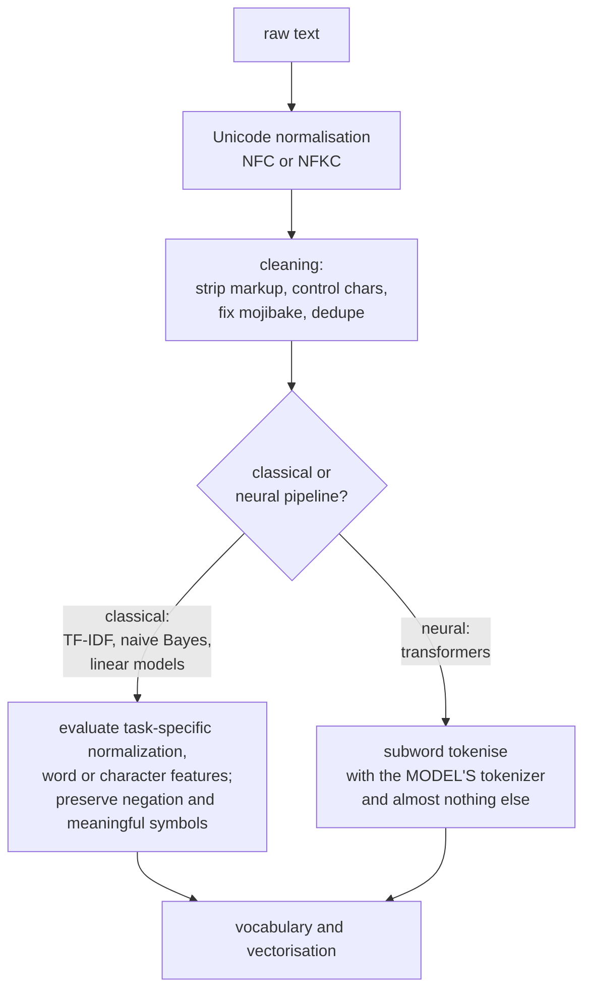

# Text Preprocessing and Tokenization

Text is the messiest common data type. It has no fixed length, no numeric
representation, ambiguous boundaries, hundreds of writing systems, and multiple
byte sequences that render identically. Everything downstream depends on how you
turn it into integers, and tokenization decisions leak into model behaviour in
ways that surprise people years later.

## The pipeline, and how much of it survives



The single most important thing to know: **for a pretrained transformer, most of
the classical preprocessing is wrong.** Lowercasing destroys the casing signal
the model was pretrained with. Removing stopwords destroys syntax. Stemming
produces strings absent from the tokenizer's vocabulary. Use the model's own
tokenizer and leave the text alone.

Classical preprocessing choices still deserve task-specific ablations: TF-IDF plus a
linear classifier remains a strong, fast baseline — so the distinction is
between pipelines, not between old and new.

## Unicode, and why it bites

| Issue | Example | Handling |
|---|---|---|
| Multiple encodings of one glyph | "é" as U+00E9, or "e" + U+0301 | NFC normalisation |
| Compatibility variants | "fi" ligature, full-width "Ａ" | NFKC (lossier) |
| Invisible characters | zero-width joiner, soft hyphen, BOM | preserve meaningful joiners; handle specific unwanted controls explicitly |
| Homoglyphs | Cyrillic "а" vs Latin "a" | confusable detection; a real spam-evasion vector |
| Mojibake | "’" from UTF-8 read as Latin-1 | `ftfy`, or fix the ingestion |
| Emoji and skin-tone modifiers | multi-codepoint grapheme clusters | do not split graphemes |
| Right-to-left and bidi controls | Arabic, Hebrew, bidi override attacks | retain raw text; audit and handle according to task and display/security policy |

```python
import unicodedata

def clean(text):
    # Retain the original separately; normalization can change offsets.
    if "\x00" in text:
        raise ValueError("NUL requires an explicit ingestion policy")
    return unicodedata.normalize("NFC", text)
```

**NFC or NFKC?** NFC composes canonical equivalents and is lossless for meaning.
NFKC additionally folds compatibility variants — it turns "½" into "1⁄2" and
full-width characters into ASCII, which normalises away real distinctions.
Use NFC by default; NFKC when you want aggressive normalisation and have checked
that the folds are acceptable for your language.

## Why tokenization is hard

**Whitespace splitting fails immediately.** "don't" → is that one token or two?
"New York" is one concept and two words. Chinese and Japanese have no spaces at
all. German compounds ("Donaudampfschiffahrtsgesellschaft") are single words
that encode a whole phrase. URLs, code, chemical formulae, and emoji all break
the assumption differently.

**Word-level vocabularies fail at scale.** A fixed vocabulary of 50k words has
three problems: an enormous embedding matrix, no way to represent any word
outside it (every unseen word becomes `[UNK]`, destroying information), and no
relationship between "run", "running", and "runner".

**Character-level solves coverage and fails at length.** No out-of-vocabulary
words ever, a tiny vocabulary — but sequences are 4–5× longer, attention is
quadratic in length, and the model must learn word structure from scratch.

**Subword tokenization is the compromise**: frequent words stay whole, rare
words decompose into meaningful pieces. `unhappiness` → `un` + `happi` + `ness`.

## Byte-pair encoding

Originally a compression algorithm, adapted to tokenization. Start from
characters (or bytes) and repeatedly merge the most frequent adjacent pair.

### Worked example

Corpus with word frequencies: `low` ×5, `lower` ×2, `newest` ×6, `widest` ×3.
Represent each word as characters with an end-of-word marker:

```
l o w </w>        x5
l o w e r </w>    x2
n e w e s t </w>  x6
w i d e s t </w>  x3
```

Count adjacent pairs across the corpus:

| Pair | Count |
|---|---|
| `e s` | 6 + 3 = **9** |
| `s t` | 6 + 3 = 9 |
| `l o` | 5 + 2 = 7 |
| `o w` | 5 + 2 = 7 |
| `t </w>` | 6 + 3 = 9 |

Merge `e s` → `es` (ties broken by first occurrence). Recount, and the next
merges follow:

| Step | Merge | Result |
|---|---|---|
| 1 | `e s` → `es` | `n e w es t </w>`, `w i d es t </w>` |
| 2 | `es t` → `est` | `n e w est </w>`, `w i d est </w>` |
| 3 | `est </w>` → `est</w>` | `n e w est</w>`, `w i d est</w>` |
| 4 | `l o` → `lo` | `lo w </w>`, `lo w e r </w>` |
| 5 | `lo w` → `low` | `low </w>`, `low e r </w>` |

The algorithm has **discovered the suffix `est`** and the stem `low` without any
linguistic input — purely from co-occurrence statistics. Continue until the
vocabulary reaches the target size. The learned merge list, applied in order, is
the tokenizer.

### Byte-level BPE

GPT-2's variant operates on **bytes** rather than Unicode characters. The base
vocabulary is exactly 256, and every possible byte sequence is representable, so
there is **no `[UNK]` token, ever** — any input in any script, plus binary
garbage, tokenises successfully. This is why modern LLMs handle arbitrary
Unicode gracefully.

The cost: non-Latin scripts are less efficient, because a character that is 3–4
UTF-8 bytes may become several tokens. Thai, Burmese, and many Indic languages
consume 3–5× more tokens per character than English, which means proportionally
higher API cost and less effective context — a real and under-discussed equity
issue in LLM access.

## The tokenizer families

| Algorithm | Merge criterion | Used by |
|---|---|---|
| **BPE** | most frequent adjacent pair | GPT-2/3/4, Llama, RoBERTa |
| **WordPiece** | pair maximising $\frac{P(xy)}{P(x)P(y)}$ — likelihood gain, not raw frequency | BERT, DistilBERT, ELECTRA |
| **Unigram LM** | start large, iteratively **remove** tokens whose deletion costs least likelihood | ALBERT, T5, XLNet, many multilingual models |
| **SentencePiece** | a framework wrapping BPE or Unigram | most multilingual models |

**WordPiece's criterion** differs from BPE's in a meaningful way: it merges the
pair whose combination most increases the corpus likelihood, which prefers pairs
that occur together more than chance predicts. In practice the vocabularies are
similar, and WordPiece marks continuations with `##` (`playing` → `play`,
`##ing`).

**Unigram is subtractive**, and its useful property is that it defines a
*probabilistic* segmentation — a word can be tokenised several ways with
different probabilities, which enables **subword regularisation**: sample a
different segmentation each epoch as data augmentation. This measurably helps
low-resource translation.

**SentencePiece** treats input as a raw stream including spaces, encoding them as
`▁`. Reconstruction is relative to the tokenizer's normalized text, not necessarily
the raw string: default normalization can alter compatibility characters and
whitespace. Preserve raw text and offset mappings when exact source reconstruction
matters. See [SentencePiece normalization/options](https://github.com/google/sentencepiece/blob/master/doc/options.md).

## Practical tokenization facts

| Rule of thumb | Value |
|---|---|
| English tokens per word | ~1.3 |
| English characters per token | ~4 |
| Tokens per 1,000 English words | ~1,300 |
| Code tokens per line | ~10–15 |
| Non-Latin scripts | 2–5× more tokens per character |

**The arithmetic tokenization problem** is a good illustration of tokenizer
consequences. If `1234` tokenises as `12`+`34` and `5678` as `567`+`8`, digit
positions do not align, and the model must learn arithmetic over inconsistent
groupings. Some tokenizer families use individual digits, but Llama 3's official
pattern groups one to three digits. Do not transfer an earlier Llama tokenizer
rule to every successor. See [Llama 3's tokenizer](https://github.com/meta-llama/llama3/blob/main/llama/tokenizer.py).

**Trailing whitespace is a real bug source.** A prompt ending in a space
tokenises differently from one that does not, because most tokenizers attach a
leading space to the following word (`" the"` is a different token from `"the"`).
Whether trimming helps is task-dependent: code indentation, completion prefixes
and exact-format tasks may require that whitespace. Test the actual token IDs
rather than stripping it universally.

**Special tokens** must be handled deliberately: `[CLS]`, `[SEP]`, `[MASK]`,
BOS/EOS, padding, and chat control tokens. Use `apply_chat_template` rather than
hand-writing them — every instruct model has its own scheme, and getting it wrong
degrades quality substantially while looking fine.

```python
tok = AutoTokenizer.from_pretrained(model_name)     # ALWAYS from the same checkpoint
tok.padding_side = "left"        # required for batched generation with a causal LM
if tok.pad_token_id is None:
    if tok.eos_token_id is None:
        raise ValueError("Choose a model-specific pad-token policy")
    tok.pad_token = tok.eos_token
enc = tok(texts, padding=True, truncation=True, max_length=512, return_tensors="pt")
prompt = tok.apply_chat_template(messages, tokenize=False, add_generation_prompt=True)
```

## Classical preprocessing

Candidate transformations for a TF-IDF or bag-of-words pipeline, not mandatory defaults.

### Stopword removal

Remove high-frequency function words ("the", "is", "of").

| Helps | Hurts |
|---|---|
| Topic modelling | sentiment ("not good" → "good") |
| Keyword extraction | negation-sensitive tasks |
| Search indexing | phrase matching ("to be or not to be") |
| Reducing dimensionality | anything where syntax matters |

TF-IDF already down-weights common terms, so explicit stopword removal is often
redundant. **Never remove stopwords for a transformer.**

### Stemming vs lemmatization

| | Stemming | Lemmatization |
|---|---|---|
| Method | rule-based suffix chopping | dictionary + morphological analysis |
| Output | may not be a real word (`studies` → `studi`) | aims for a valid contextual lemma; dictionary coverage and disambiguation can fail |
| Needs POS | no | yes, for accuracy (`meeting` as noun vs verb) |
| Speed | very fast | slower |
| Algorithms | Porter, Snowball, Lancaster | WordNet, spaCy, Stanza |

Stemming is aggressive and cheap; lemmatization is accurate and slower. For
search, stemming is usually enough. For anything where the output is shown to a
human, lemmatize.

### Other classical steps

| Step | Note |
|---|---|
| Lowercasing | loses proper nouns and acronyms ("US" vs "us"); fine for topic tasks |
| Punctuation removal | loses sentence boundaries and emphasis |
| Number normalisation | replace with a `<NUM>` token, or spell out |
| Contraction expansion | "don't" → "do not" |
| Spelling correction | risky — it can destroy names and domain terms |
| Sentence splitting | harder than it looks: "Dr. Smith went to Washington." |
| Language identification | `fasttext` or `langdetect`; essential for multilingual corpora |
| Deduplication | **the highest-value step for pretraining corpora** — MinHash/LSH near-duplicate removal |

**Deduplication deserves emphasis.** Duplicated documents in a pretraining corpus
cause memorisation, inflate evaluation scores through test-set contamination, and
waste compute. Exact-match dedup catches little; MinHash-LSH near-duplicate
detection at document and paragraph level is standard practice for every serious
corpus.

## Handling the awkward cases

| Case | Approach |
|---|---|
| Very long documents | chunk with overlap; or a long-context model; or hierarchical encoding |
| Code | a code-aware tokenizer; preserve indentation and newlines |
| Tables in text | linearise with explicit separators, or a table-aware model |
| Mixed languages | a multilingual tokenizer; do not split by language |
| Noisy user text | character n-grams are robust to typos; do not over-correct |
| Domain jargon | check the tokenizer's fertility on your terms; consider vocabulary extension |
| PII | detect and redact **before** training; it will otherwise be memorised |

**Chunking for retrieval** is worth doing carefully. Fixed-size chunks split
sentences and lose context; the usual recipe is to respect structural boundaries
(paragraphs, sections, headings), use 200–500 tokens with 10–20% overlap, and
prepend the document title and section heading to each chunk so the embedding
carries context the chunk text alone does not.

## Common mistakes

| Mistake | Consequence |
|---|---|
| Lowercasing before a cased pretrained model | throws away a signal the model uses |
| Removing stopwords before a transformer | destroys syntax |
| Using a different tokenizer than the checkpoint | garbage embeddings, silently |
| Fitting a vectorizer on train+test | vocabulary leakage |
| Ignoring `max_length` truncation | silently dropping the end of every long document |
| Right padding for causal generation | the model generates from a pad position |
| Assuming 1 token = 1 word | context and cost estimates off by ~30% |
| Changing trailing whitespace without checking the task | changes token boundaries and may damage code/completion prefixes |
| Skipping deduplication in a pretraining corpus | memorisation and contaminated evaluation |
| Normalising away emoji or casing in sentiment tasks | both carry signal |

## Self-check

### Runnable normalization and tokenizer round trip

This trains a tiny local byte-level BPE with the Hugging Face `tokenizers` library,
without files or downloads. The normalization example uses a combining character
and a joiner: character count, UTF-8 byte count and visible grapheme count are
different quantities. Model offsets must be related to the retained raw source,
especially after normalization or redaction.

```python runnable
import unicodedata
from tokenizers import Tokenizer, models, trainers, pre_tokenizers, decoders
raw = "Cafe\u0301 and x\u200dy"
normalized = unicodedata.normalize("NFC", raw)
assert "\u200d" in normalized and normalized != raw
assert len(raw.encode("utf-8")) > len(raw)
tokenizer = Tokenizer(models.BPE(unk_token="[UNK]"))
tokenizer.pre_tokenizer = pre_tokenizers.ByteLevel(add_prefix_space=False)
tokenizer.decoder = decoders.ByteLevel()
trainer = trainers.BpeTrainer(vocab_size=280, special_tokens=["[UNK]"],
    initial_alphabet=pre_tokenizers.ByteLevel.alphabet())
tokenizer.train_from_iterator(["low lower newest widest", normalized, "x = 1234\n"], trainer)
restored = Tokenizer.from_str(tokenizer.to_str())
for text in [normalized, "unknown symbol: \u03a9", "  indented\n", "1234567"]:
    encoding = restored.encode(text)
    assert "[UNK]" not in encoding.tokens
    assert restored.decode(encoding.ids) == text
    assert all(0 <= start <= stop <= len(text) for start, stop in encoding.offsets)
print("joiner preservation, byte coverage and in-memory tokenizer reload passed")
```

**How does a Unigram model score alternatives?** Multiply token probabilities
within a segmentation, then sum over alternative segmentations for the string's
likelihood. With tokens `a`, `b`, `ab` having probabilities .4, .3, .3, the
two segmentations of `ab` contribute .12 and .3, totaling .42 before conditioning
on any additional boundary convention. **What is the WordPiece ratio?** The
pair-frequency/marginal-frequency ratio is a common pedagogical reconstruction,
not a complete specification of every original WordPiece trainer. **How should
duplicates be split?** Group related documents before partition assignment, then
fit tokenizers/vectorizers only on training data and record the grouping policy.

1. Run three BPE merge steps on the corpus `low`×5, `lowest`×2, `newer`×6.
2. Why does byte-level BPE never produce an `[UNK]` token, and what does it cost?
3. How does WordPiece's merge criterion differ from BPE's, and what does it
   prefer?
4. Why does a trailing space in a prompt change model output?
5. Give three preprocessing steps that are correct for TF-IDF and wrong for BERT.
6. Why do some models tokenise digits individually?
7. What is the highest-value preprocessing step for a pretraining corpus, and
   why?

## Where to go next

- [Text Representation](./text-representation.md) — turning tokens into vectors.
- [Language Models](./language-models.md) — what the tokens are fed into.
- [RAG & Retrieval](./rag-and-retrieval.md) — where chunking decisions matter
  most.
