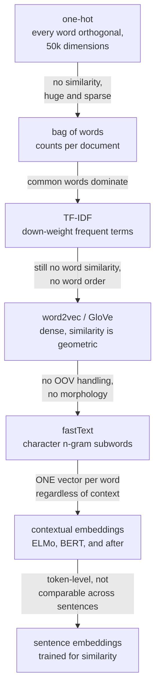

# Text Representation: From Counts to Embeddings

A model needs numbers. The history of NLP is largely the history of better
answers to "what numbers?", and each step solved a specific limitation of the
one before it.



## Sparse representations

### One-hot and bag of words

One-hot gives every word an orthogonal basis vector: 50,000 dimensions, all
zeros but one. Every pair of distinct words has cosine similarity exactly zero,
so `cat` and `kitten` are as unrelated as `cat` and `bureaucracy`.

Bag of words sums one-hot vectors over a document, producing counts. It discards
word order entirely — "dog bites man" and "man bites dog" are identical.

### TF-IDF

Weight each term by how often it appears in this document and how *rare* it is
across the corpus:

$$\mathrm{tfidf}(t,d) = \mathrm{tf}(t,d)\cdot\log\frac{N}{1+\mathrm{df}(t)}$$

The IDF term is the interesting half. A word appearing in every document has
$\mathrm{df} = N$, so its IDF is ~0 and it contributes nothing — TF-IDF performs
automatic stopword removal. A word appearing in three documents out of a million
gets a large weight, because it is highly discriminative.

Practical settings that matter:

```python
TfidfVectorizer(
    ngram_range=(1, 2),      # unigrams + bigrams captures "not good", "new york"
    min_df=5,                # drop terms in fewer than 5 documents — mostly typos
    max_df=0.7,              # drop terms in >70% of documents — corpus-specific stopwords
    sublinear_tf=True,       # 1 + log(tf): 10 occurrences is not 10x as relevant
    strip_accents="unicode",
)
```

**`sublinear_tf` is the setting people miss.** Raw term frequency assumes
relevance grows linearly with count, which is wrong — a document mentioning
"python" 50 times is not 50× more about Python than one mentioning it once. The
log damping consistently helps.

**TF-IDF plus a linear model remains a strong baseline** for topical text
classification: it trains in seconds, needs no GPU, is fully interpretable
(inspect the coefficients), and on many datasets lands within a few points of a
fine-tuned transformer. Always run it first.

**BM25** is TF-IDF's better-engineered relative and the standard for retrieval.
It adds term-frequency saturation (a parameter $k_1$ bounds the contribution of
repeated terms) and document-length normalisation ($b$), both of which TF-IDF
handles crudely. Every production keyword-search system uses BM25, not TF-IDF.

## Word embeddings

### The distributional hypothesis

> "You shall know a word by the company it keeps." — Firth, 1957

Words appearing in similar contexts have similar meanings. Every word embedding
method is an operationalisation of this claim.

### word2vec

Two architectures, both shallow:

- **Skip-gram**: given a centre word, predict its context words. Better for rare
  words and small corpora.
- **CBOW**: given context words, predict the centre word. Faster, better for
  frequent words.

The skip-gram objective:

$$\frac{1}{T}\sum_{t=1}^{T}\sum_{-c\le j\le c,\,j\ne0}\log p(w_{t+j}\mid w_t), \qquad p(w_O\mid w_I) = \frac{\exp(\mathbf{v}'^\top_{w_O}\mathbf{v}_{w_I})}{\sum_{w=1}^{V}\exp(\mathbf{v}'^\top_{w}\mathbf{v}_{w_I})}$$

That denominator sums over the entire vocabulary at every step — computationally
impossible for $V = 10^6$. The fix that made word2vec practical:

**Negative sampling** replaces the full softmax with a binary classification: is
this (word, context) pair real, or drawn from noise?

$$\log\sigma(\mathbf{v}'^\top_{w_O}\mathbf{v}_{w_I}) + \sum_{i=1}^{k}\mathbb{E}_{w_i\sim P_n(w)}\bigl[\log\sigma(-\mathbf{v}'^\top_{w_i}\mathbf{v}_{w_I})\bigr]$$

with $k = 5$–20 negatives drawn from the unigram distribution raised to the 3/4
power — an empirical choice that samples rare words more often than their raw
frequency would.

**Subsampling frequent words** discards a token with probability
$1-\sqrt{t/f(w)}$, which both speeds training and improves rare-word vectors, on
the reasoning that the millionth occurrence of "the" carries almost no
information.

### The famous analogies

$$\mathbf{v}_{\text{king}} - \mathbf{v}_{\text{man}} + \mathbf{v}_{\text{woman}} \approx \mathbf{v}_{\text{queen}}$$

Genuinely remarkable, and genuinely over-sold. The standard evaluation excludes
the three input words from the answer candidates — without that exclusion, the
nearest vector to the result is frequently `king` itself. The analogy structure
is real but weaker and more dataset-dependent than the headline suggests.

### GloVe

Where word2vec is predictive, GloVe is explicitly a **matrix factorisation** of
global co-occurrence statistics:

$$J = \sum_{i,j=1}^{V} f(X_{ij})\bigl(\mathbf{w}_i^\top\tilde{\mathbf{w}}_j + b_i + \tilde{b}_j - \log X_{ij}\bigr)^2$$

with $X_{ij}$ the co-occurrence count and $f$ a weighting that caps the influence
of very frequent pairs. The motivating insight is that **ratios** of
co-occurrence probabilities encode meaning: $P(\text{solid}\mid\text{ice}) /
P(\text{solid}\mid\text{steam})$ is large, while the same ratio for "water" is
near 1.

In practice word2vec and GloVe perform comparably; the choice is not important.

### fastText

Represent each word as a bag of character n-grams plus the word itself:
`where` → `<wh`, `whe`, `her`, `ere`, `re>`, `<where>`.

Two consequences that matter:

1. **Out-of-vocabulary words get vectors.** An unseen word is the sum of its
   n-gram vectors, so misspellings, new words, and rare technical terms all work.
2. **Morphology is captured for free.** `run`, `running`, `runner` share n-grams
   and therefore share representation, which is a large advantage for
   morphologically rich languages (Finnish, Turkish, Arabic).

### The shared, fatal limitation

**One vector per word type, regardless of context.** `bank` gets a single vector
that must serve "river bank" and "investment bank". Polysemy is unrepresentable,
and the vector ends up as a blend of all senses weighted by corpus frequency.

That limitation is what contextual embeddings exist to remove, and it is worth
seeing as the direct motivation for everything that followed.

## Contextual embeddings

Produce a **different** vector for each occurrence of a word, computed from its
sentence.

| Model | Mechanism |
|---|---|
| **ELMo** | deep bidirectional LSTM language model; a learned combination of layers |
| **BERT** | masked language modelling with a bidirectional transformer |
| RoBERTa | BERT with better training: more data, dynamic masking, no NSP |
| DeBERTa | disentangled content/position attention; among the strongest encoders |
| ModernBERT | 2024-era encoder: 8k context, RoPE, FlashAttention, modern data |
| Decoder LMs | hidden states from GPT-family models, used as features |

**Which layer?** Different layers encode different things — lower layers carry
surface and morphological information, middle layers carry syntax, upper layers
carry semantics and task-specific structure. For feature extraction, a
concatenation or average of the last four layers usually beats the final layer
alone, because the final layer is specialised toward the pretraining objective.

### The `[CLS]` trap

**Do not use raw BERT `[CLS]` embeddings for semantic similarity.** Out of the
box they perform *worse* than averaged GloVe vectors on sentence-similarity
benchmarks. The reason is that BERT's pretraining objective never asked for
sentence vectors to be comparable by cosine distance, and the resulting embedding
space is highly anisotropic — all vectors occupy a narrow cone, so cosine
similarities are compressed into a small range near 1.

## Sentence embeddings

Trained explicitly so that cosine similarity means semantic similarity.

| Model family | Training |
|---|---|
| **Sentence-BERT** | siamese network with a triplet or contrastive objective on NLI and STS data |
| SimCSE | contrastive with dropout as the only augmentation — two forward passes of the same sentence are the positive pair |
| **E5 / BGE / GTE** | large-scale contrastive pretraining on weakly supervised pairs, then supervised fine-tuning |
| Instructor / INSTRUCTOR-style | task instructions prepended, so one model serves multiple similarity notions |
| OpenAI / Cohere / Voyage embeddings | proprietary API models |
| ColBERT | **late interaction**: per-token vectors, similarity by max-sim; much better recall, larger index |
| Matryoshka embeddings | trained so that truncating to fewer dimensions still works |

**SimCSE's unsupervised version is elegantly simple**: encode the same sentence
twice with dropout active, treat the two encodings as a positive pair, and use
other sentences in the batch as negatives. Dropout is the entire augmentation,
and it works remarkably well.

```python
from sentence_transformers import SentenceTransformer
model = SentenceTransformer("BAAI/bge-base-en-v1.5")
emb = model.encode(sentences, normalize_embeddings=True, batch_size=64)
sim = emb @ emb.T                              # cosine, since vectors are normalised
```

**Normalise before comparing.** With L2-normalised vectors, the dot product *is*
cosine similarity, which lets you use fast inner-product search.

**Asymmetric search needs prefixes.** Models like E5 and BGE are trained with
distinct instructions for queries and documents (`"query: "` / `"passage: "`).
Omitting them measurably degrades retrieval, and it is a silent failure.

## Choosing an embedding model

| Consideration | Guidance |
|---|---|
| Benchmark | **MTEB** is the standard leaderboard — but check the tasks that match your use case, not the average |
| Dimensionality | 384 vs 768 vs 1536 — larger is marginally better and proportionally more expensive to store and search |
| Max sequence length | 512 tokens is common; long documents need chunking or a long-context model |
| Domain | a general model may fail on legal, biomedical, or code text; check on your own data |
| Multilingual | multilingual-E5, LaBSE, BGE-M3 for cross-lingual retrieval |
| Latency and cost | local small model vs API; embeddings are cheap but high-volume |
| Symmetric vs asymmetric | similarity between two sentences vs query-to-document |

**Evaluate on your own data.** MTEB rankings are strongly influenced by the
benchmark composition, and a model two places lower on the leaderboard may be
substantially better on your domain. A few hundred labelled query–document pairs
is enough to tell.

## Vector search

Exact nearest-neighbour search is $O(Nd)$ per query — fine for $10^5$ vectors,
too slow for $10^8$.

| Index | Idea | Trade-off |
|---|---|---|
| Flat / brute force | exact | slow above ~1M vectors |
| **IVF** | cluster, search only the nearest $n$ clusters | tune `nprobe` for recall/speed |
| **HNSW** | navigable small-world graph | fast and accurate; high memory |
| **PQ / IVF-PQ** | compress vectors into subspace codes | huge memory saving, some recall loss |
| ScaNN | anisotropic quantisation | strong accuracy/speed frontier |
| DiskANN | graph index on SSD | billion-scale on one machine |

| System | Character |
|---|---|
| FAISS | the library; maximum control |
| hnswlib | small, fast, embeddable |
| Qdrant / Weaviate / Milvus | dedicated vector databases with filtering and persistence |
| pgvector | Postgres extension — keeps vectors next to your relational data |
| Elasticsearch / OpenSearch | vector plus BM25 in one system |

**Metadata filtering is the practical differentiator.** "Find similar documents
*from this tenant, in this date range, with this permission level*" is the real
requirement, and pre-filtering versus post-filtering has very different
performance characteristics. Systems that handle filtered vector search well are
worth the dependency.

## Other representations

| Representation | Use |
|---|---|
| Character n-grams | robust to typos; strong for names, codes, short strings |
| Doc2Vec | document vectors learned jointly with word vectors; largely superseded |
| LSA / LSI | SVD on the term–document matrix; the original dense representation |
| Topic models (LDA, NMF) | interpretable soft clustering |
| **Hybrid dense + sparse** | combine BM25 with dense retrieval; reliably beats either alone |
| SPLADE | learned *sparse* representations — interpretable and searchable with an inverted index |

**Hybrid retrieval is the practical default.** Dense embeddings capture semantic
similarity and miss exact matches (product codes, rare names, specific numbers);
BM25 does the reverse. Combining the two — usually with reciprocal rank fusion —
beats either consistently, and the implementation is a dozen lines.

## Bias in embeddings

Embeddings absorb the statistical regularities of their training corpus,
including the prejudicial ones. The word-embedding association test found the
same associations as the human implicit association test: European-American names
with pleasant words, male terms with career terms, female terms with family
terms.

Debiasing by projecting out a "gender direction" was shown to be largely
cosmetic — the association is recoverable from the remaining geometry, because it
is distributed rather than localised. The honest position: **measure the bias in
your specific application**, evaluate downstream disparity rather than the
embedding geometry, and treat the embedding as a component whose failures must be
handled at the system level.

## Self-check

1. Why does IDF perform automatic stopword removal?
2. What problem does negative sampling solve in word2vec, and what does it
   replace?
3. Give two things fastText can do that word2vec cannot, and say why.
4. Why do raw BERT `[CLS]` embeddings underperform averaged GloVe on sentence
   similarity?
5. What is SimCSE's unsupervised augmentation?
6. When would you choose BM25 over a dense embedding model, and what beats both?
7. Why must query and document prefixes be used with E5-style models?

## Where to go next

- [Language Models](./language-models.md) — the models that produce contextual
  embeddings.
- [RAG & Retrieval](./rag-and-retrieval.md) — putting embeddings to work.
- [Text Classification](./text-classification.md) — the classic consumer of
  these representations.
